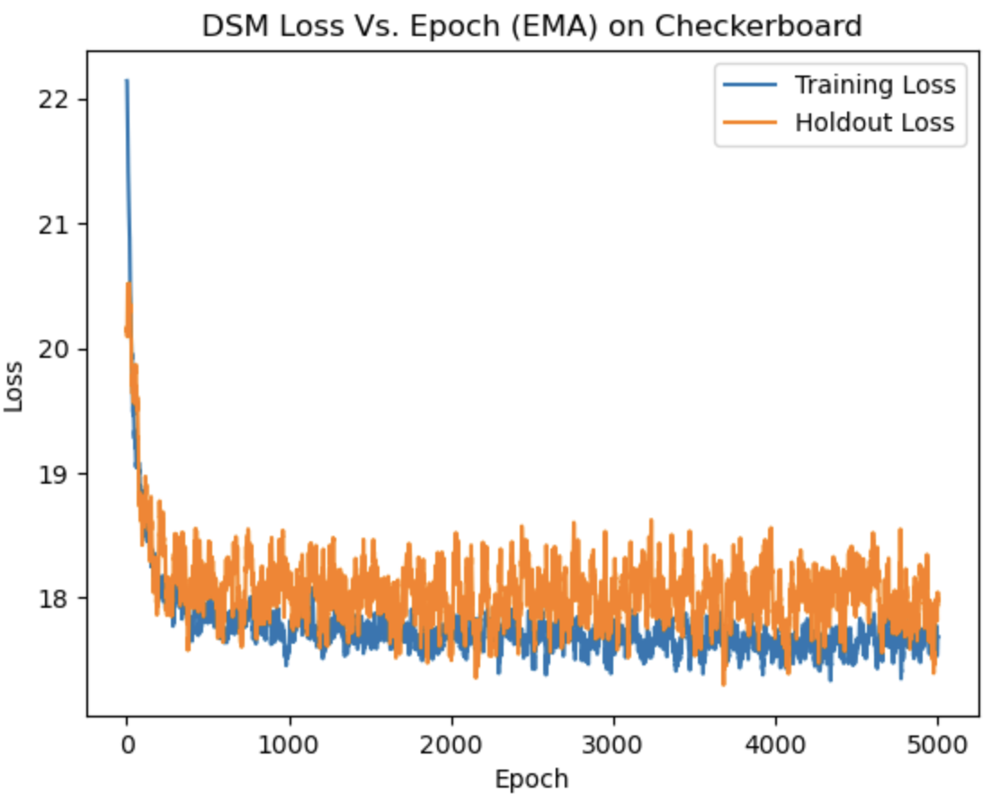

<a name="readme-top"></a>

## About The Project

This project aims to uncover the latent patterns in the space generated by two data-generating functions (Checkerboard and Gaussian_mixtures) by leveraging two different methods: Denoising Score Matching (DSM) and Variational Autoencoder (VAE). The learned model is then utilized to generate new data points that remain within the same latent space, preserving the underlying structure and distribution of the original data.

<p align="right">(<a href="#readme-top">back to top</a>)</p>


### Built With

* Python
* Jupyter Notebook

<p align="right">(<a href="#readme-top">back to top</a>)</p>

<!-- GETTING STARTED -->


## Prerequisites and Installation

 Models are based on JAX and these key packages need to be installed in advance.
* jax

  ```sh
  pip install -U jax
  ```

* flax

  ```sh
  pip install flax
  ```

* chex

  ```sh
  pip install chex
  ```

* optax

  ```sh
  pip install git+https://github.com/google-deepmind/optax.git
  ```

* haiku

  ```sh
  pip install git+https://github.com/deepmind/dm-haiku
  ```

  

<p align="right">(<a href="#readme-top">back to top</a>)</p>


<!-- USAGE EXAMPLES -->

## Project Structure

```sh
generative-model-project/
├── args.py                           # Model configs
├── data_generation.py                # Custom data generation
├── model.py                          # Implementation of the DSM & VAE
├── generative_model_notebook.ipynb   # Main file: training, evaluation, visualization
└── README.md                          
```


<p align="right">(<a href="#readme-top">back to top</a>)</p>


<!-- ROADMAP -->
## Output Examples

**Training loss over time**

<p align="center">
  
</p>


**Generated Samples**

<p align="center">
  
</p>


<!-- CONTRIBUTING -->
